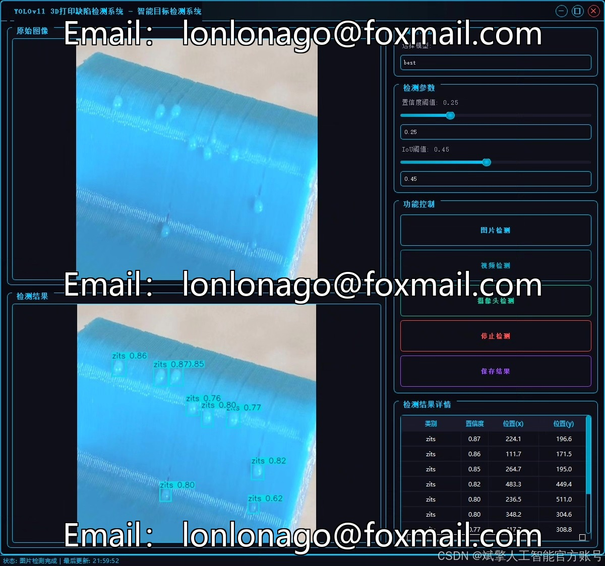
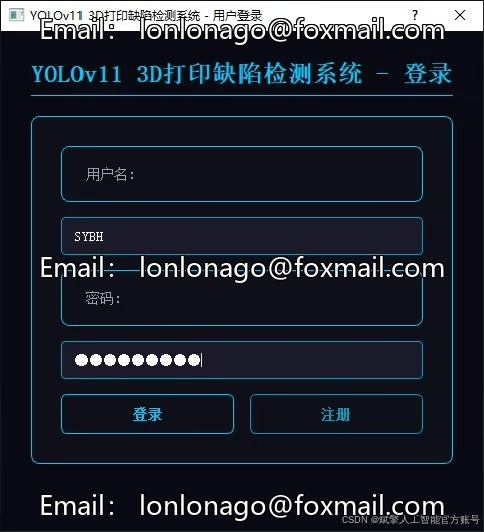
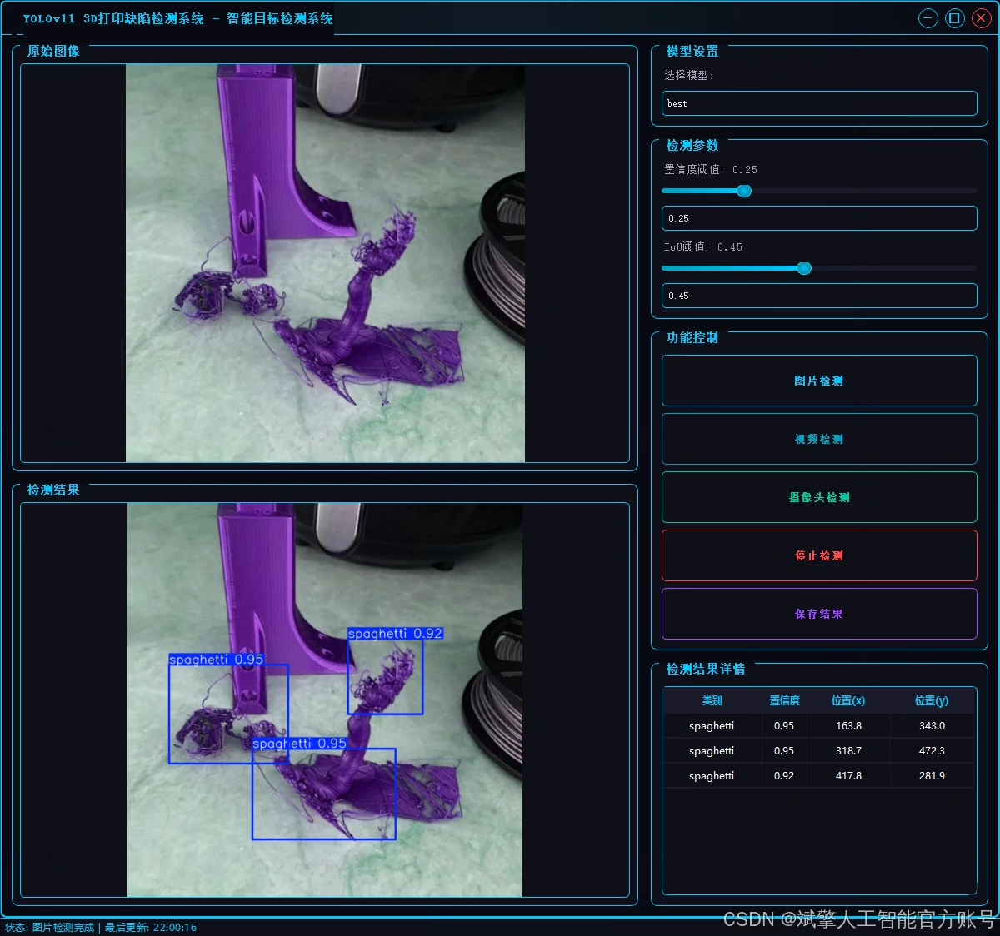
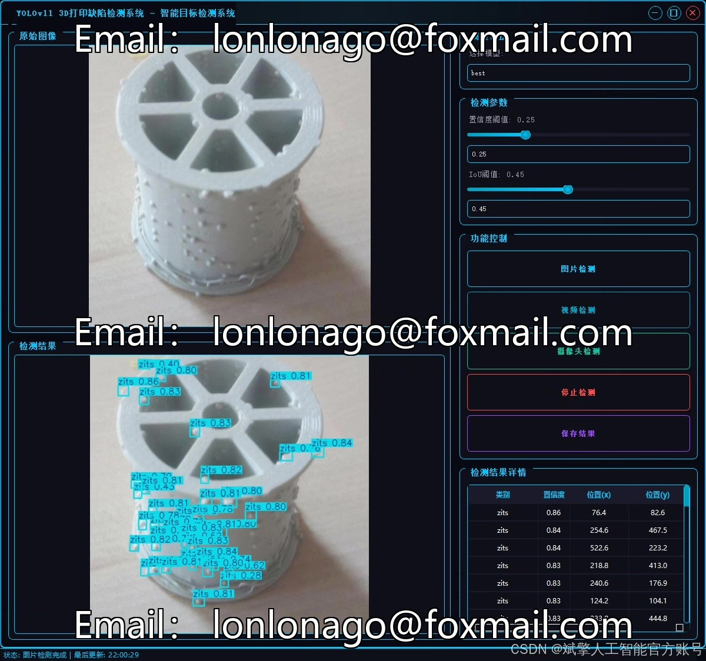
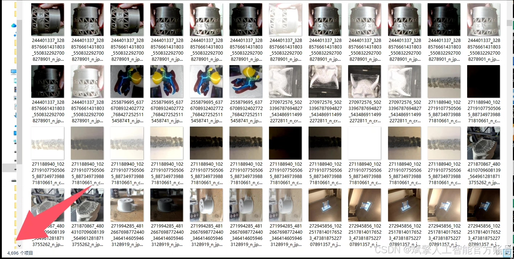
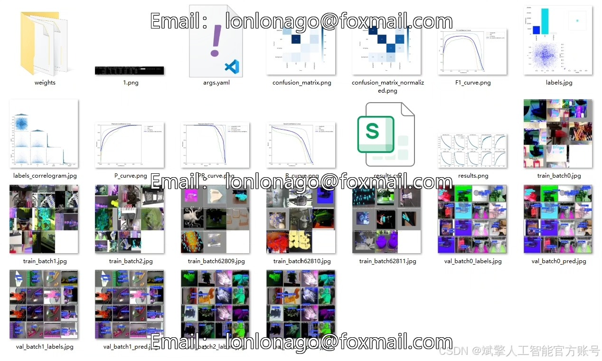
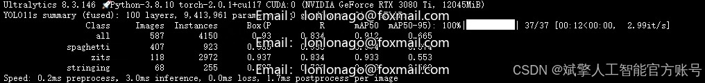
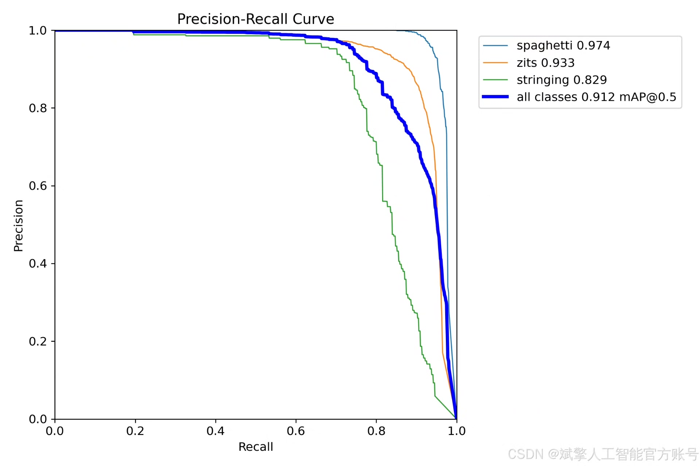
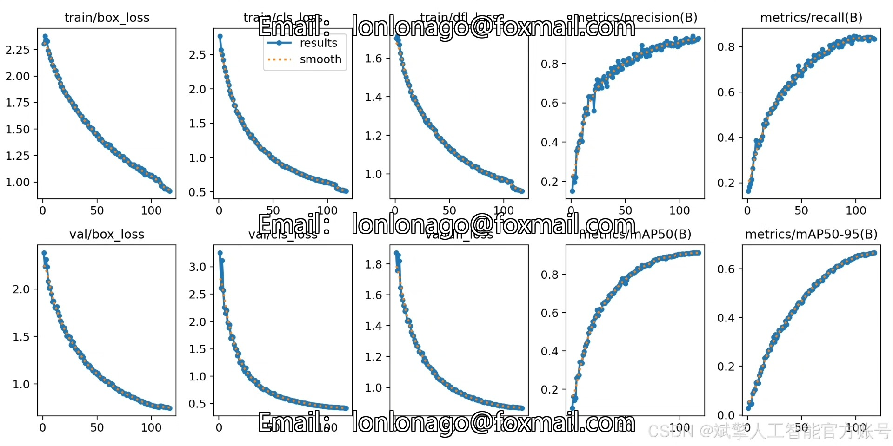

# YOLOv11 3D Defect Intelligent Identification

## Body

YOLOv11 3D Defect Intelligent Identification Based on Deep Learning YOLOv11's 3D Printing Defect Detection System (YOLOv11+YOLO dataset + UI interface + login registration interface + Python project source code + model)

nc: 3 classes,
Name: ['spaghetti', 'zits', 'stringing'],
Dataset quantity: training set 4696, validation set 587, test set 587.

✅ User Login and Registration: Support password detection and security verification.

✅ Three detection modes: based on the YOLOv11 model, support image, video, and real-time camera three detection, accurately identify the target.

✅ Dual screen comparison: display the original scene and detection results in the same screen.

✅ Data visualization: real-time table display of detection targets' categories, confidence, and coordinates.

✅ Intelligent parameter adjustment: provide a confidence slide bar, dynamically optimize detection accuracy to meet different scene needs.

✅ Sci-fi style interactive interface: dark theme combined with dynamic light effects, reduce visual fatigue, improve operation experience.

## Images

## Payment

Here is a pay link on Stripe ( https://buy.stripe.com/3cs8yP7sY87d0vu9AB ). Please contact me lonlonago@foxmail.com after funding $89, and I will send you a complete data files , thank you!

